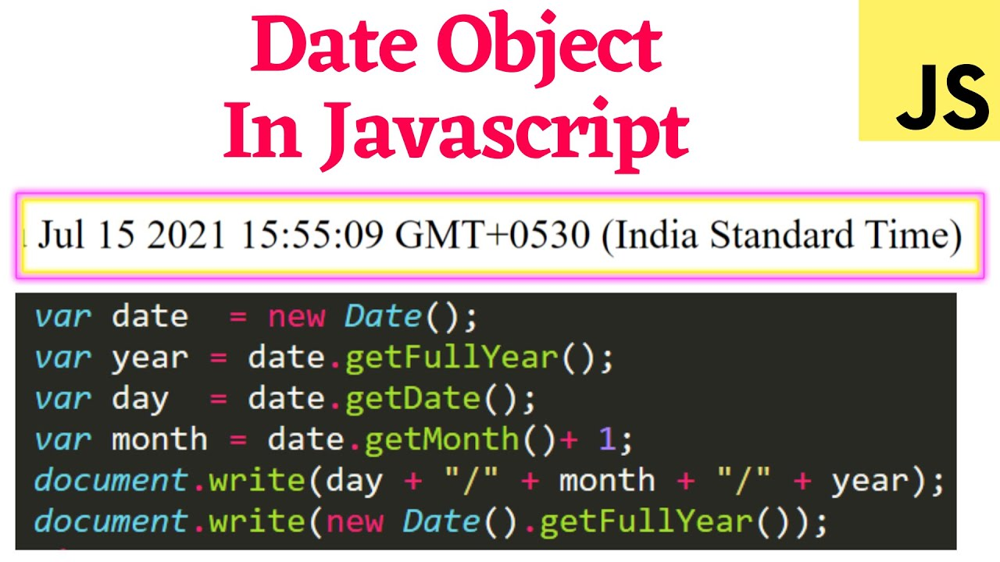
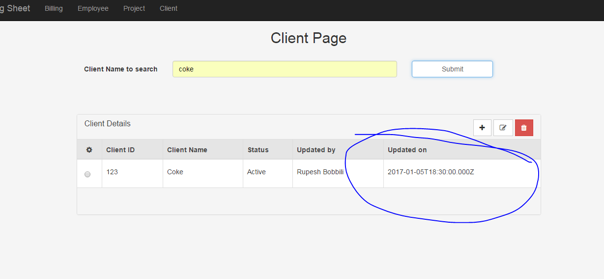
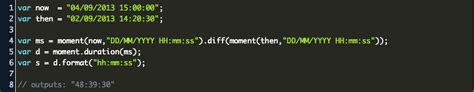
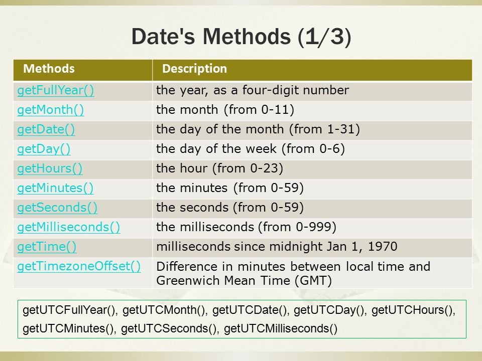
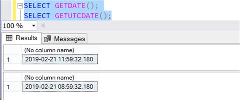

# Data and Time

> In this tutorial, you will learn about date and time in JavaScript with the help of examples. In JavaScript, date and time are represented by the Date object.The Date object provides the date and time information and also provides various methods. A JavaScript date defines the EcmaScript epoch that represents milliseconds since 1 January 1970 UTC. This date and time is the same as the UNIX epoch (predominant base value for computer-recorded date and time values)

# Creating Date Objects 
### There are four ways to create a date object:
- ##### new Date()
- ##### new Date(milliseconds)
- ##### new Date(Date string)
- ##### new Date(year, month, day, hours, minutes, seconds, milliseconds)


# new Date()
#### You can create a date object using the new Date() constructor. For example,


# new Date(milliseconds)
#### A Date object contains a number representing milliseconds  since January 1, 1970 UTC. New Date(milliseconds) Creates a new Date object by adding milliseconds to the zero time. For example,
```JS
let time = new Date(0)
console.log(time);
/// 1970-01-01T00:00:00.000Z
```

# new Date(date string)
#### New Date - (date string) creates a new date object from the date string. In JavaScript, there are generally three date input formats. ISO Date Formats You can create a date object by passing ISO date formats. For example
```JS
let time = new Date("2022-02-16")
console.log(time);
/// 2022-02-16T00:00:00.000Z
```

## new Date(year, month, day, hours, minutes, seconds,milliseconds) 
> Note: If you pass only one argument, it will count as milliseconds. Therefore, to use this date format, you must pass two arguments. In JavaScript, months are counted from 0 to 11. January is 0 and 
December is 11
```JS
let time = new Date(2020, 1, 20, 4, 12, 11, 0)
console.log(time);
/// 2020-02-20T04:12:11.000Z
```
# Date Methods in JavaScript
## 1. now()
#### Date.now() returns the number of milliseconds since January 1, 1970.


## 2. getFullYear()
### getFullYear() returns the full year of a date (4 digits).


## 3. getMonth()
### getMonth() returns the month (0 to 11) of the date. January 0, February = 1, ..


## 4. getDate()
### The getDate() method returns the day of the month (1 to 31) of the date.
``` JS
let al = new Date();
console.log(a.getDate());
///26
```


## 5. getDay()
### The getDay() method returns the day of the week (0 to 6) of the date. Sunday = 0, Monday = 1,...
``` JS
let al = new Date();
console.log(a.getDay());
///4
```


## 6. getHours()
### getHours() returns the hours (0 to 23) of a date.
``` JS
let al = new Date();
console.log(a.getHours());
///11
```


## 7. getMinutes()
### getMinutes() returns the minutes (0 to 59) of a date.
``` JS
let al = new Date();
console.log(a.getMinutes());
///11
```


## 8. getUTCDate()
#### getUTCDate() returns the day of the month (1 to 31) of a date object. 
### getUTCDate() returns the date in UTC.


## 10. setFullYear()
#### setFullYear() sets the year of the date.
#### setFullYear() can also set the month and day.
``` JS
let al = new Date();
console.log(a.setFullYear(2020));
///1581934679119
```

## 11. setMonth()
#### The setMonth() method sets the month of the date object.
#### This method can also be used to set the day of the month.
``` JS
let al = new Date();
a.setMonth(4);
console.log(a);
///2023-05-2T10:35:40.966Z
```


## 12. setDate()
#### setDate() sets the day month of the date.
``` JS
let al = new Date();
a.setDate(15);
console.log(a);
///2022-02-15T10:35:40.966Z
```


## 13. setUTCDate()
#### The setUTCDate() method sets the date of the Date object according to UTC.
``` JS
let al = new Date();
a.setUTCDate(15);
console.log(a);
///2022-02-15T10:35:40.966Z
```


